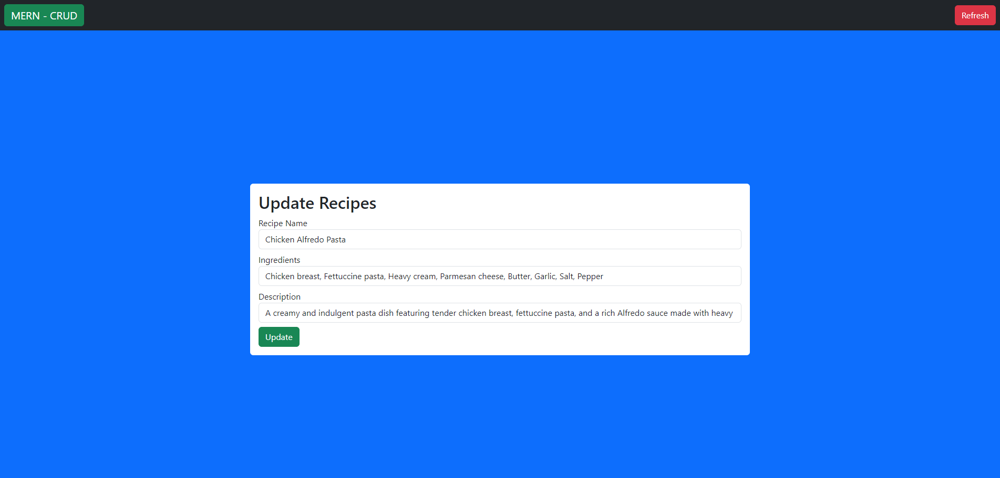
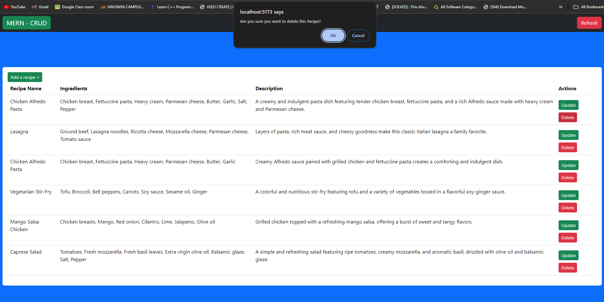
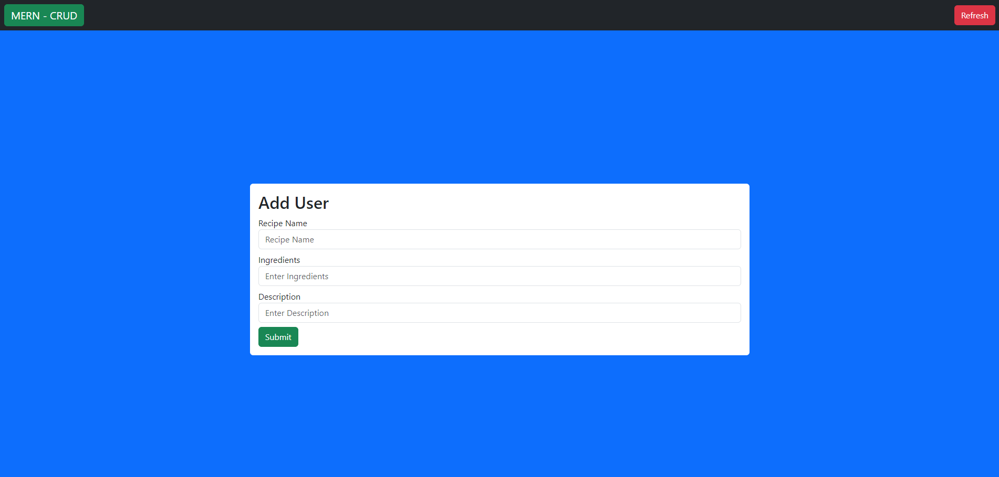
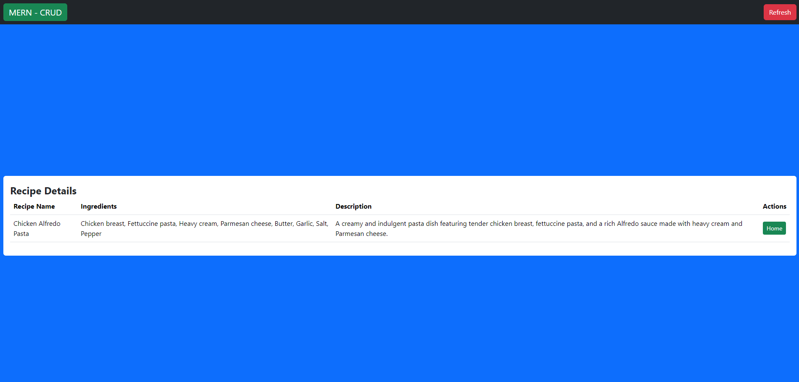

# MERN - REDUX (CRUD)- BACKEND

This is a Full-Stack web app with CRUD operations created using Redux for state management and it allows users to Create, Read, Update, and Delete, Recipe CRUD's fields: recipeName, ingredients, and description. It is built using a modern tech stack, including React, MongoDB, Vite, Bootstrap, Express, and Node.js.

## Features

- Create
- Read
- Update
- Delete

## Tech Stack

- **Frontend:**
  - React
  - Vite
  - Bootstrap CSS
  
- **Backend:**
  - Express
  - Node.js
  - MongoDB
 
  **To run the project,
  - clone both Frontend and Backend to the same directory.(https://github.com/MADHURANGA-SKP/MERN-Frontend)
  - then open it using IDE(VS code).
    
    ## Frontend
  - open the terminal then change the current working directory to Frontend, type "npm install" and press enter, then installation, installs all relevant packages and any packages that Frontend depends on.
  - then to start the Frontend type "npm run dev" Then it will start your development server on a specific PORT.
    
    ## Backend
  - open the terminal then change the current working directory to Backend, type "npm install" and press enter, then installation, installs all relevant packages and any packages that Backend depends on.
  - before start your development server, you must install MongoDB compass, and make the connection with the database with mongodb provided connection string to adding it to index.js files.
  - it looks like this mongoose.connect("mongodb+srv://<your-credentials>@cluster.xxxxxx.mongodb.net/crud");
  - if you haven't created Mongodb atlas you have to create your own database to accomplish the above steps, you can make that by following this link "https://www.mongodb.com/docs/atlas/getting-started/"
  - you have to add your database USERNAME & PASSWORD to this section <your-credentials> like this USERNAME:PASSWORD.
  - then start your development server by typing "nodemon index.js" Then it will start your development server on a specific PORT.

## Preview

## Functionality 
**const express = require("express")**

- Imports the Express.js framework.

**const app = express()**

- Creates an Express application.

## Middleware Setup
**app.use(cors())**

- Enables cors middleware for enable Cross-Origin Resource Sharing.

**app.use(express.json())** 

- Middleware to parse incoming JSON data.

## Database Connection
**mongoose.connect("mongodb+srv://<username>:<password>@cluster5.zzu4wuw.mongodb.net/crud")**

- Connects to a MongoDB database using the Mongoose library and a connection string.

**app.get("/", ...)**

- Handles a GET request to the root route

**app.post("/create", ...)**

- Handles a POST request to the "/create" route

**app.put("/update/:id", ...)**

- Handles a PUT request to the "/update/:id" route

**app.delete("/deleteuser/:id", ...)**

- Handles a DELETE request to the "/deleteuser/:id" route

## Server Start
- app.listen(3001, ...)

- Starts the Express application and makes it listen on port 3001. Displays a message once the server is running.

## Module

sets up a Mongoose schema with three fields for a MongoDB collection named "users": recipeName, ingredients, and description. 
It then creates a Mongoose model (RecipeModel) based on this schema.
Then exports the model for use in other parts of the application, allowing interaction with the MongoDB collection
